# Web Typography, 2022/2023
### Beschrijving vak
Als je doof bent, of als je om een andere reden geen geluid kunt horen, dan mis je veel informatie als je een film kijkt. Knisperende voetstappen, langzaam aanzwellende muziek, nerveus getik op een deur, je hoort het natuurlijk allemaal niet. Nu bestaat er zoiets als *closed caption*, wat een type ondertiteling is waarbij ook dingen als omgevingsgeluiden en de muziek beschreven worden. Hierdoor krijgt een kijker die informatie wel binnen.

Alleen wordt die auditieve informatie nogal neutraal beschreven. Het geluid van huilend persoon zou bijvoorbeeld beschreven kunnen worden als *snikgeluid op de achtergrond*. En iemand die lacht zou geschreven kunnen worden als *iemand lacht.* Heel neutraal, bijna zakelijk, en bovendien allebei in precies hetzelfde neutrale lettertype. Terwijl het toch echt over twee heel verschillende emoties gaat. 

Dat kan visueel sterker. 

En dat gaan jullie doen.

# Voortgang
## Eerste ideeën
Ik heb opgelet naar hoe ik me voel tijdens het bekijken van het fragment. Dit wilde ik graag repliceren in het ontwerp.

Eerste ideeën:

- Het geluid van de 'sirene' zou rood en blauw zijn zoals op een politie auto 
- De andere geluiden in het begin zijn best hard dus misschien iets met rode kleuren doen?
- Op het einde is er een piepgeluid die steeds harder en irritanter wordt - deze merk je pas later op. De film is ook donker dus hoe luider het piepgeluid wordt wil ik een witte achtergrond gebruiken die steeds feller wordt om het geluid uit te beelden. Dit lijkt me vrij irritant om te zien in een bioscoop bijvoorbeeld.
- Naast de witte achtergrond wil ik misschien iets doen met het beeld? Dat het trilt of kleiner wordt misschien zodat je je een beetje gespannen voelt


## Wit Piepgeluid
De ideeën hierboven heb ik toegevoegd en had tot daaraan geen screenshots en zo gemaakt, omdat ik het was vergeten. Maar voor een lange tijd heb ik geworsteld met hoe ik het witte steeds groter kon krijgen op het einde met een knipperend effect. 

Ik heb met een `::before` een cirkel toegevoegd en daarmee het witte geïmiteerd. 
Maar op de een of andere manier pakte hij de styling van een cirkel van de scanner geluiden. En ging van rechtsonder naar het midden animeren.


Na die struggle heb ik gekeken of ik het witte dat steeds groter werd intenser kon maken. Ik wilde dat hij langzaam steeds groter werd en op het einde lichtelijk een flickering effect zou krijgen. Hieronder zie je een aantal experimenten ermee.


<details>

<summary> :shipit: Code voor knipperen wit stuk </summary>

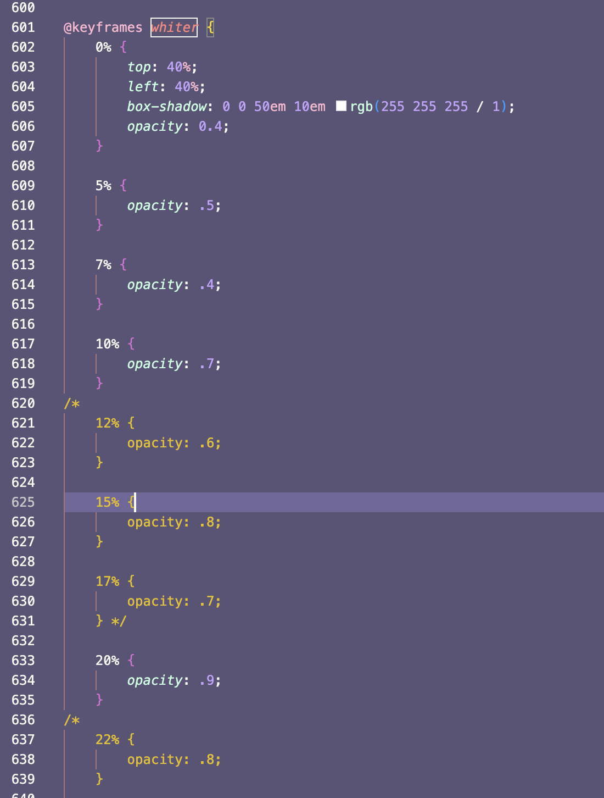
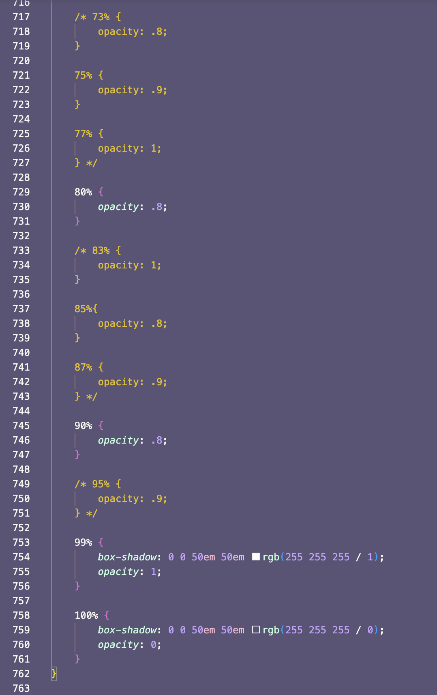

</details>


Met de code hierboven wilde ik het knipperende vormgeven maar uiteindelijk lukte het dus niet en heb het weggehaald.

Wel lukte het witte nu wel - met het groter maken.
In de afbeeldingen was ik nog bezig met het veranderen van de tekstkleur op de juiste momenten.

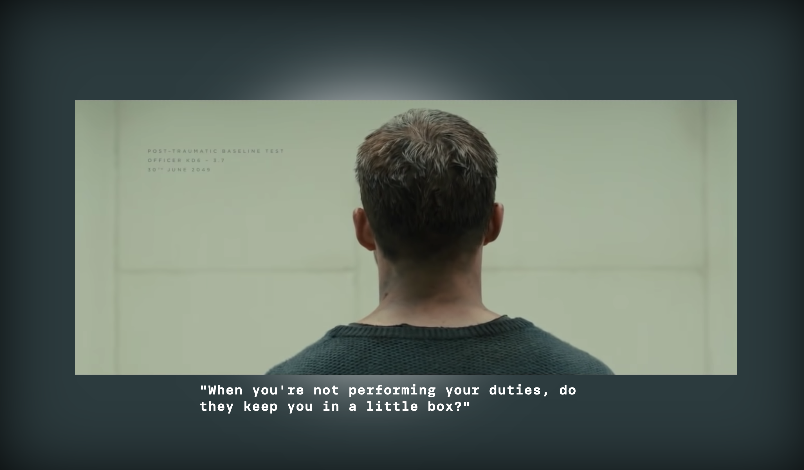
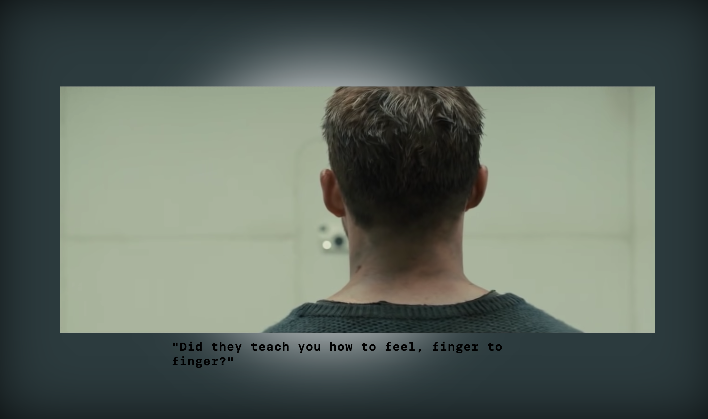
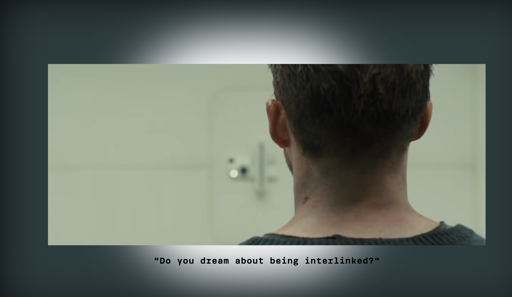

Uiteindelijk heb ik het zo opgelost:

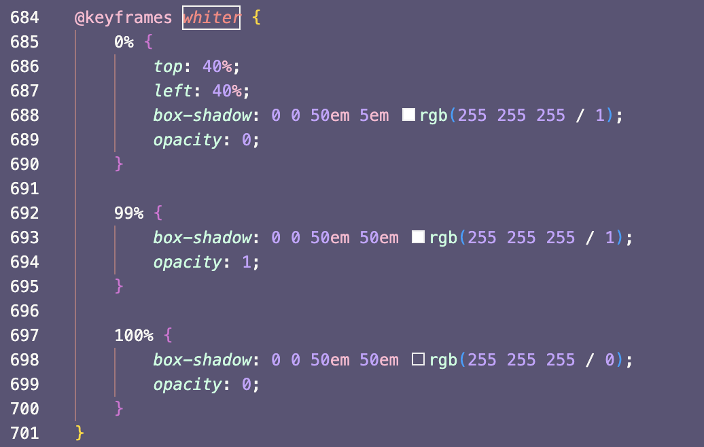


## Chattering
In een deel van het fragment hoor je mensen praten op de achtergrond. Ik wilde hiermee ook iets doen. 
Als eerst dacht ik eraan om het met code te doen maar ik wist niet hoe dus heb het toen met Adobe After Effects gedaan toen ik hoorde dat dit mocht.

Ik heb toen in AE het woord 'chatter' een aantal keer ingetypt en dit verschillende styling gegeven (groot, klein, uitgerekt, platgedrukt, condensed etc.) en sommige toen laten bewegen en andere verdwijnen en verschijnen. Uitendelijk zag het er zo uit:

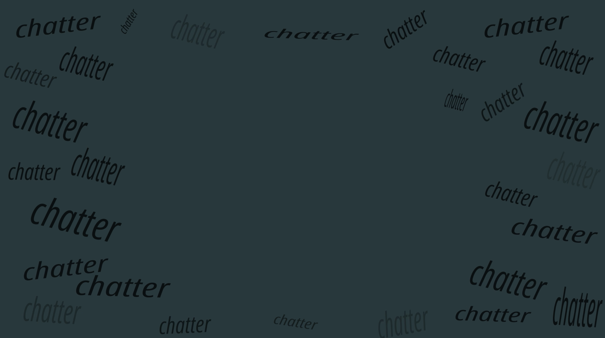


Het zag er uiteindelijk iets te komisch/cartoon-achtig uit en had ook deze feedback gekregen van een vriend dus heb dit toen veranderd naar audio lijnen. Dit heb ik ook in Adobe After Effects gemaakt. Ik heb [deze tutorial](https://youtu.be/Xd-CMLPO7Q4) gevolgd.

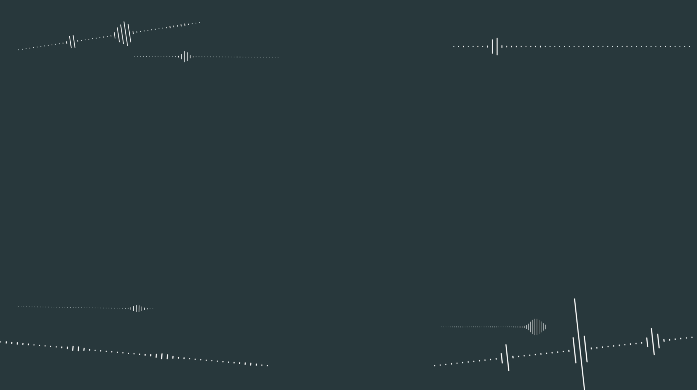
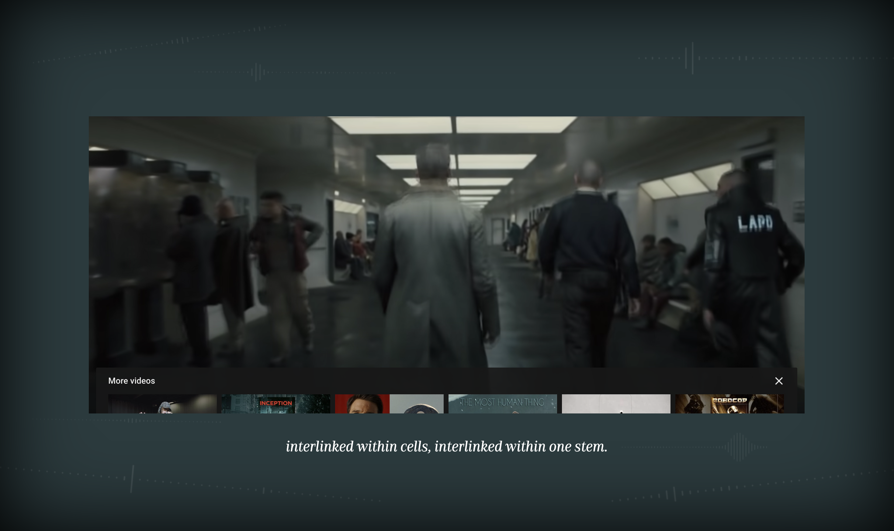


## Background Music
Ik wilde ook iets doen met de 'background music' die in het begin afspeelt. Nu heb ik heel subtiel een boxshadow toegevoegd aan de body die soort van ademt. Die wilde ik eigenlijk wat intenser hebben.
Ik heb geprobeerd om ook een box-shadow op het fragment te plaatsen, maar deze was er tot aan het eind en ik wist niet zo goed hoe ik hem er weer eraf moest halen, dus heb ik het er maar gelaten. Ook omdat ik het toch niet zo mooi vond en het niet het effect gaf die ik wilde.


<details>
<summary> :shipit: Code dat ik toch niet heb gebruikt </summary>
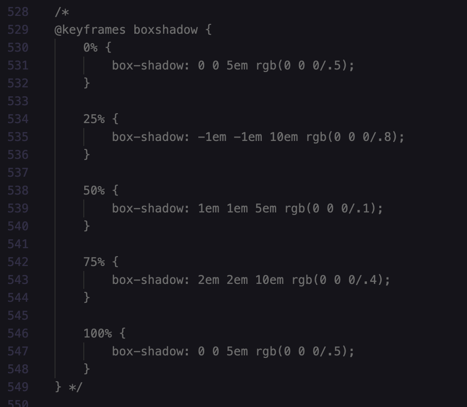
</details>


Ik heb de shadow op de body toch behouden omdat het toch een beetje het effect gaf die ik wilde laten zien. 
De schaduwen in de hoek van het scherm zouden het effect moeten geven dat er iets boven hem opdoemt en dat er elk moment iets ergs kan gebeuren. Zijn interne conflict/gevaar volgt hem.


## Nauwer/Kleiner scherm
Om de opbouw van de spanning bij de baseline test te vergroten heb ik ervoor gekozen om het fragment steeds kleiner te maken. Het is best subtiel. Wanneer het weer terug naar het originele formaat springt, merk je hoeveel het scherm was gekrompen. Je voelt dat je weer soort van normaal kunt ademen nadat het stukje is afgelopen.

<details>
<summary> :shipit: Code voor de opbouw van de spanning op het einde </summary>

`.sound9 iframe { animation: framesmaller 43s linear forwards; }`

```
@keyframes framesmaller {
	0% {
		width: 80vw;
		height: 53.33333333vw;
		margin-top: -0.35vw;
	}

	99% {
		width: 60vw;
		height: 53.33333333vw;
		margin-top: -0.35vw;
	}

	100% {
		width: 80vw;
		height: 53.33333333vw;
		margin-top: -0.35vw;
	}
}
```
</details>


## Tekst
Voor de main character heb ik getwijfeld of ik _Brenner Regular_ of _Sans_ wilde gebruiken. _Sans_ was het meest toepasselijke omdat hij soort robot-achtig is 'opgevoed' en hij ook zo door het leven gaat. Monotoon maar niet een robot. Maar ik dacht ook dat _Brenner Regular_ juist ook wat meer karakter heeft wat ook toepasselijk is bij hem, omdat hij natuurlijk een 'echt' mens is.

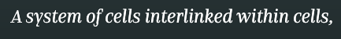

Als ik door had gegaan met het tweede fragment zou ik misschien hebben geëxperimenteerd met de twee fonts. De baseline test gaat niet goed in het tweede stuk, dus misschien had ik sommige stukjes text in Regular en anderen in _Sans_ hebben gedaan, omdat hij aan het struggelen is. 

Ik heb het einde van de film niet gezien, maar als hij zichzelf vind als het ware zou hij dan alleen in _Brenner Regular_ praten :)

De stem van de baseline test is in de stijl _Mono_ omdat het toch goed paste bij dat onpersoonlijke, robot-achtige manier van examineren - Ookal klon degene niet per se als een robot. De manier van sluit goed aan bij _Brenner Mono._


## F-Off Skin-Job
Dit was moeilijk om vorm te geven omdat hij het soort van hard fluistert. Als het kon zou ik het vormgeven met een dashed font om het fluisteren te imiteren. 
In plaatst daarvan heb ik de `letter-spacing` vergroot en _Brenner Sans_ gebruikt.

Eerst had ik ervoor gekozen om het ook _Light_ te maken, maar nadat ik er weer naar terug keek leek het iets te elegant. En te licht. Deze feedback kreeg ik ook van een vriend:
> Het laat me denken aan een L'oreal reclame

Dus heb de `font-weight` toen veranderd naar _Medium_.

###### Troubles
Ik wilde ook dat hij van links naar rechts in beeld kwam (omdat de man die het zegt ineens vanuit de linkerkant komt) maar dit wilde hij alleen doen wanneer ik het scherm refreshte en niet wanneer je hem liet afspelen.


Wat je hieronder ziet is nadat ik had gesaved: `cmd+s`


Hij werkte eigenlijk dus wel maar op de een of andere manier wilde hij het niet doen wanneer de tekst in het scherm kwam.

<details>
<summary> :shipit: Code van dat stuk </summary>
Ik heb ook geprobeerd om het alleen op .voice3 te doen en alleen op .p6, maar dat lukte ook niet.

```
.p6.voice3{
	font-family: "Brenner Sans";
	font-style: italic;
	font-weight: 600;
	font-size: 1em;

	letter-spacing: .7em;
	animation: foff 1s ease forwards;

	top: 65%;
	left: 30%;

	text-shadow: 1em 1em 1em black;
}
```

</details>


## Tweede Fragment
Ook heb ik geprobeerd om het tweede fragment te animeren. Hierbij wilde ik weer soort van het knipperende effect gebruiken en dat het steeds erger werd, maar dan met een bijna wit gekleurde bal met een groene tint zoals in de film wanneer hij de baseline test doet en een witte achtergrond. De bal zou dan steeds sneller 'stuiteren' naar verschillende kanten van het scherm.

Omdat ik steeds `::before` had gebruikt om een cirkel toe te voegen aan de CSS, dacht ik eraan om een `<div>` toe te voegen in de html zodat ik het misschien iets makkelijker kon animeren. Dit maakte uiteindelijk geen verschil en het werkte gewoon niet.

<details>
<summary> :shipit: Code van de HTML div & CSS </summary>
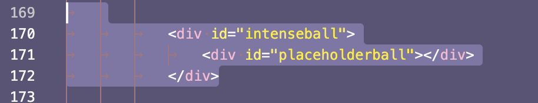
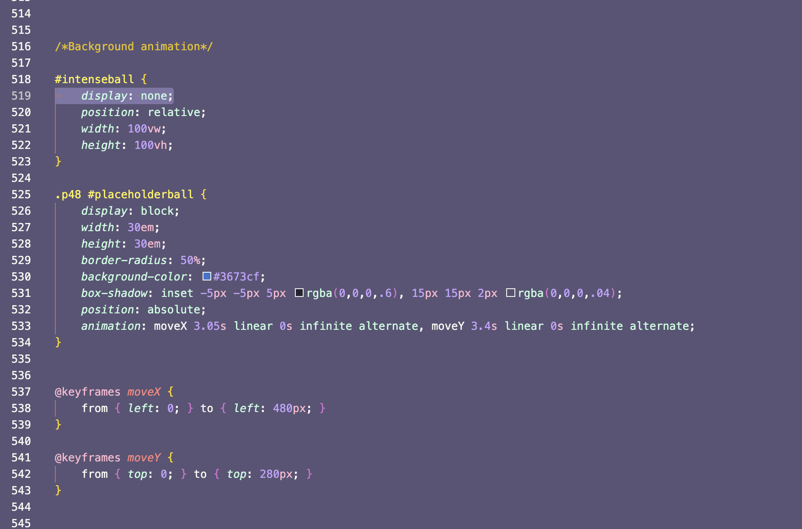
</details>

Dus toen heb ik toch weer de manier gebruikt die ik eerst had ( met `content: ""` en `display: block`).
Dat zag er zo uit (& het bewoog):

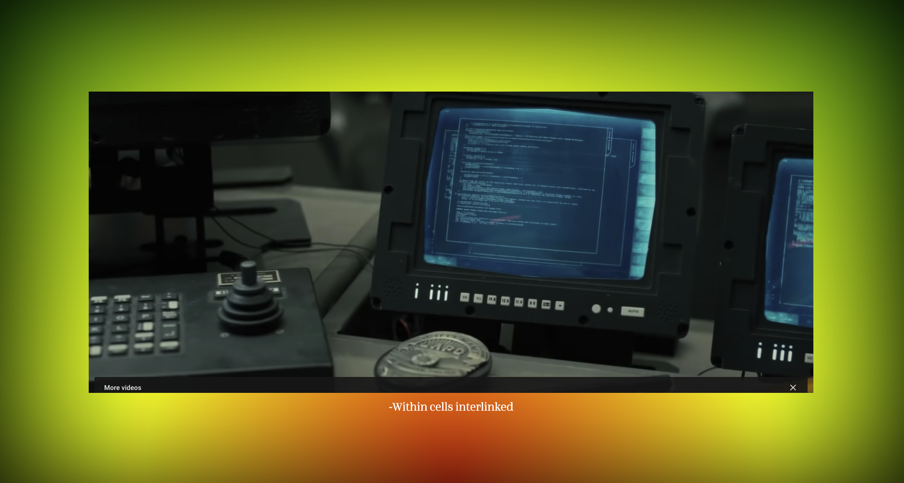


# Reflectie
Het was voor mij best moeilijk om het 'extreem' vorm te geven, omdat het zo'n langzame, mysterieuze en dramatische film was wilde ik dit ook zo behouden. 